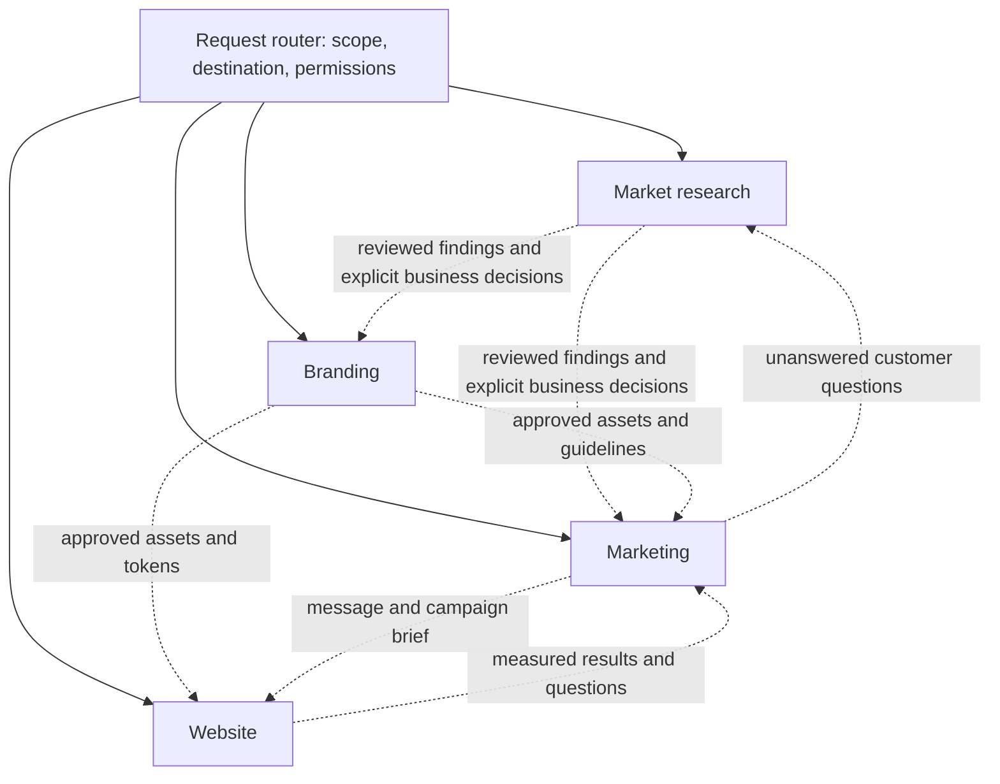

# Agent setup review: evidence quality and modularity

Reviewed 23 September 2026. Scope: reusable agent instructions, evidence collection, customer-problem synthesis, lifecycle checks, and boundaries between research, branding, marketing and website work. This is an inline review of the current working tree. Existing project research was not assessed or changed.

**Assessment.** The repository already has a strong written research method and useful provenance controls. The highest-value improvements are to connect those controls to actual stage completion, preserve collected material, and isolate module responsibilities and context. Additional specialist agents are not needed to achieve those changes.

**What is already worth preserving**

- Topic-led discovery precedes named-company feedback; the two sampling frames remain separate.
- Customer needs and solution-use requirements have separate mappings, with context, contrary evidence, source review and scope limits.
- The experience ledger checks quoted spans; source review is bound to evidence bytes; supplier voice, snippets and unsupported locale assignments face explicit checks.
- Query calibration now supports local vocabulary, exact probes, query allocation, refinement lineage and inspection of rejected records.
- Branding and Website already start independently. Case revisions, source bindings and publication ownership provide useful foundations for handoffs.
- Installed-skill/catalog/routing parity passes. The review found 39 installed skills; adding more is not the immediate priority.

These are implementation and contract observations, not proof of live research quality.

**1. High priority: connect the pain gate to validated research**

Evidence: `scripts/evidence_scout/workspace.py:377` checks that a passed pain checkpoint has a local file under `market_research/pain_points/`. The surrounding code checks file existence, revision and source hashes. It does not require a successful customer-voice/synthesis validation. The legacy branch has a similar limitation at line 288.

Reproduced through the normal modern case helpers in a temporary workspace: initialize a Business controller, register a case, write `TODO: research has not been performed.` to a pain-point file, then call `update_stage(..., status='passed', gate_result='pass', artifacts=[file], expected_assessment_revision=current_revision)`. `pain_gate_state(project, case)` returns `True`. No gate override or manual manifest edit was used. This does not show that every other downstream strategy prerequisite would also pass.

Recommended change: make the normal `problem_validation` completion command run the existing source-review, coverage and synthesis validators and bind their exact input hashes and scope to the checkpoint. Preserve an explicit, audited owner override as a separate path. Validate the segment/journey artifacts required by the workflow as part of this handoff. A structurally valid `insufficient_evidence` pack must not become a validated customer problem. Permit useful scoped findings while requiring explicit disposition of gaps material to the proposed commitment.

Acceptance: placeholder files, stale packs, wrong-case evidence and insufficient-evidence results cannot yield an ordinary pain-gate pass. A valid scoped result can be delivered without claiming broader validation. Semantic interpretation still needs review; JSON validity cannot establish genuine pain.

**2. High priority: bind discovery findings to their study and report**

Evidence: `scripts/evidence_scout/discover_market_problems.py:255` accepts a supplied VOC pack. It validates that pack using the segment taken from the pack itself. Candidate checks at line 273 establish a row count and valid U-need IDs, without binding the pack to the discovery study's question/locale or the candidate text in the report.

Reproduced with the existing synthetic VOC fixture: a CH:de household-moving pack was supplied to a US:en dental-procurement discovery run. The report had the required headings and an unrelated dental candidate. Finalization returned exit 0, `status=complete`, `gate_result=conditional_pass`, and `candidate_count=1`. This is a mismatched-study acceptance, not a demonstration that commercial demand passed validation.

Recommended change: extend the existing run/pack contract with study and case identity, declared question and locale scope, and explicit applicability bindings for imported research. Bind each report candidate to its structured candidate ID and reviewed needs. Reuse source-binding helpers. Keep cross-market analogs possible through a reasoned applicability record. Render supported candidate sections from checked structured data or verify their bindings during publication. Retain a semantic review of the inference from source to candidate.

Acceptance: the mismatched study is rejected unless its import and applicability are explicitly recorded; a narrative candidate cannot pass on an unrelated structured need. Publication records the reviewed report and pack hashes.

**3. High priority: repair source retention before expanding retrieval**

Reran `docs/audits/research-query-expansion-2026-09-23/reproduce.py` against current code. Both previously reported defects remain reproducible:

| Capture | Actual result | Consequence |
| --- | --- | --- |
| TikTok, Instagram and Threads each return three valid posts; shared allowance is three | Only TikTok survives. Instagram and Threads are labelled `items_without_text`; no Instagram comments are scheduled | The retained sample is shaped by endpoint order and missing coverage is misdescribed |
| One YouTube video, comments and a requested transcript; allowance is five | Video and four comments survive; transcript reports fetched but its text is absent from normalized and raw capture | Requested enrichment is irretrievably lost while provider status is `ok` |

Locations: `collect.py:1596`, `collect.py:2332`, `collect.py:2778`, and `collect.py:2898`. Transcripts are creator context, not independent customer testimony; their loss still undermines requested research.

Follow the existing `docs/agent-improvements/2026-09-23-provider-retention-fix-plan.md`: allocate by requested source lane, persist enrichment before selection, separate capture and retention counts, and preserve comment coverage. Avoid a second competing fix plan.

**4. Medium priority: make research recoverable during collection**

Code inspection: `collect.py:4682` loops through providers and accumulates normalized records in memory. The main evidence/irrelevant ledgers are appended at lines 4728–4729 after that loop. Several raw/query captures are saved earlier, so an interruption does not necessarily lose all raw material, but the normalized study and its aggregate status are incomplete until the end.

Recommended change: persist each completed capture and its disposition, checkpoint completed query/provider identities, and resume idempotently. Preserve query memberships when deduplicating. Distinguish discovered URLs, captured documents, speaker episodes and independently attributable customers. Reuse run folders and JSONL artifacts. Implement this together with the existing retention plan.

**5. Medium priority: evaluate finding quality, not only the contracts around it**

`scripts/run_evals.py` explicitly checks eval structure. `scripts/run_behavioral_evals.py` runs a deterministic router without an LLM. `evals/voc/live/check_fixtures.py` explicitly reports no human gold labels, no held-out set, and no executed semantic model comparison. There are valuable synthetic research-quality tests and development examples; they do not measure whether an agent discovers and interprets customer problems well on unseen material.

Recommended addition: extend the existing VOC evaluation area with a small, diverse, independently reviewed set of documents and expected speaker episodes. Evaluate missed consequential episodes, incorrect customer/supplier attribution, repeated-person counts, resolved complaints, invented motives/consequences, needs versus product requirements, and unsupported payment/prevalence claims. Include unfamiliar vocabulary and languages. Separate retrieval recall within a bounded known-source corpus from extraction accuracy and synthesis quality. Record unreviewed cases rather than scoring them as negatives. Run the same tasks before and after changes with model/version and tool evidence recorded.

A reviewer pass can use a separate context when explicitly authorized. It should inspect sources and specific claims; agreement between two agents does not establish correctness.

**Recommended research execution loop**

The written method already describes most of this loop. Make it the normal run path and visible progress record:

1. Specify the decision, uncertainty, relevant job/role/locale/source cells, and what would change the conclusion.
2. Probe contrasting query families: problem episodes, successful alternatives, workarounds, non-adoption and switching. Use source-derived vocabulary and keep topic/entity frames separate.
3. Persist captures; extract located speaker episodes; inspect both accepted and rejected leads.
4. Review attribution, fit and independence. Record the episode as situation → action/alternative → outcome → consequence, marking each unsupported component unknown.
5. Form provisional problem findings and compare counterexamples. Preserve differences by context instead of combining every complaint into one broad pain.
6. Choose the next batch from a material gap: missing role, unclear consequence, inaccessible source, alternative explanation, or missing contrast. More provider calls are useful only if they address such a gap.
7. Stop with a scoped answer or an explicit reason to switch to interviews/observation/authorized behavioral tests. Public complaints establish possible occurrence; purchasing and switching conclusions need their own evidence.

Use the current query ledger, source review, codebook, U/R maps and `next_investigations` fields. A second scoring system or another research database would add maintenance before solving the observed failures.

**Proposed module boundaries**

Keep one small request router and four domain entry points. Modules are ownership and context boundaries; they do not require four simultaneous autonomous agents.

| Module | Responsibility and existing skills | Authoritative output | Handoff boundary |
| --- | --- | --- | --- |
| Market research | `market-problem-discovery`, `idea-grill`, `evidence-scout`, competitor specialists, `interview-bridge` | Reviewed experiences, segments, journeys, needs, alternatives, counter-evidence and scope limits | Supplies supported findings; business positioning/feasibility remains an explicit existing decision workflow |
| Branding | `brand-designer` and its current specialists | Approved identity, voice, tokens, assets and brand manifest | Consumes a brief or an explicit research/business handoff; does not establish demand |
| Marketing | `marketing-strategy-builder`, `social-digital-marketing-planner`, monitoring | Audience/message/offer applications, channel hypotheses, campaign briefs and learning results | Consumes approved positioning and permitted claims; requests targeted evidence when a decision is unsupported |
| Website | `brand-website-designer-builder`, relevant UI specialists | Site, content implementation, accessibility/performance/functional QA and release state | Consumes brand assets and approved message/claim inputs; implementation completion does not imply business or campaign success |

Dotted connections are optional, explicitly selected handoffs. Website and Branding retain their independent entry paths. Business-model/position selection remains owned by existing strategy skills; neither research synthesis nor marketing copy silently changes that decision.

The current layout already supports independent Business, Branding, Website and other assets. `references/subprojects.md:22` deliberately keeps marketing inside Business, and `scripts/subprojects.py:10` has no marketing destination. Making Marketing independently startable would therefore be a deliberate policy and lifecycle extension, not simply a folder rename. Recommended behavior: an established business can supply a marketing brief and accepted positioning; a business-linked venture launch retains its current problem/selection gates. Do not relabel an already blocked venture launch as standalone marketing.

**How to implement modularity without a rewrite**

- Keep `.agents/skills/<name>/SKILL.md` discoverable and reuse the existing entry skills. Add module ownership and entry references to the existing catalog rather than introducing a separate parallel router/catalog.
- Reduce root `AGENTS.md` to shared scope, authorization, ownership, routing and evidence principles. It currently contains 22,438 bytes, including detailed provider/community protocols. Load those protocols when the Research module needs them.
- Give each module one focused entry document describing its inputs, output owner, allowed operations, completion conditions and required references. Load only that module and its selected specialist's context.
- Keep shared mechanics together: project/case identity, source bindings, safe publication, provider transport, permissions and validation utilities. Research owns evidence artifacts; other modules reference them instead of editing copies.
- Gradually split the 4,805-line `collect.py` behind its existing CLI into provider adapters, scheduling/allocation, normalization/provenance and orchestration/persistence. Preserve behavior with focused provider-contract checks. Fix retention first so extraction does not freeze known defects into new modules.
- Handoffs should carry source paths/digests, source owner/revision, accepted decisions, unresolved limits, intended use and destination. A changed source marks its consumers for review; it does not automatically regenerate their outputs. Extend existing manifests and source bindings.
- Begin with logical module boundaries and compatible paths. If independent Marketing requires a new root destination, use the existing subproject publication mechanism and a separately planned, rehearsed migration. Preserve existing project paths until then.

**Smaller setup issues**

- `business-strategist/SKILL.md:16` asks for approval before paid providers, conflicting with standing authorization for customer-evidence APIs in `AGENTS.md:100` and evidence-scout. The higher-priority user authorization governs, but the skill should clearly reuse it. Other paid generation, advertising and external actions retain their own boundaries.
- `.claude/hooks/precompact.py:32` and line 47 scan only legacy `projects/*/market_research/...` paths. They omit modern Business/case paths. The shared `resume.json` is also not session-scoped. Reuse the current workspace resolver and preserve the selected module/case/run, unresolved question and next action per session. Live host-hook invocation was not tested.

**Implementation order**

1. Repair transcript/social retention and incremental recovery using the existing fix plan.
2. Bind problem-validation and discovery completion to the correct reviewed artifacts, identities and dispositions. Add the two newly reproduced failure cases as regressions.
3. Establish four module owners and slim root context; align standing permissions and modern resume paths.
4. Add the independently reviewed semantic evaluation, then use its failures to refine query/extraction/synthesis behavior.
5. Extract provider adapters incrementally. Add optional bounded source workers only where distinct retrieval methods justify them; workers write disjoint run directories and a coordinator owns deduplication and synthesis. Agent completion is not evidence completeness.

**Verification performed**

- `python3 scripts/validate_skill_routes.py`: passed; no catalog/disk/routing errors.
- `python3 scripts/run_evals.py`: 170 skill cases and 31 routing cases structurally valid; existing missing-eval warning for `town-db-curator`.
- Focused pytest run over VOC quality, customer-feedback completion, pain-query calibration, research-query expansion and multilingual regressions: **158 passed**.
- Existing offline retention reproduction: both defects reproduced against current code.
- Additional temporary-workspace probes: placeholder pain gate accepted; unrelated VOC pack finalized as complete/conditional pass.

All behavioral probes used synthetic data. No live APIs, model comparison, market findings, host-hook activation or whole-repository correctness were verified. No implementation files, permissions or existing research were changed by this review.

**Web research addendum: improving analysis and output quality**

Sources retrieved 23 September 2026 using web search and Firecrawl. This addendum addresses quality of interpretation and deliverables. Recommendations below are adaptations to this repository, not measured improvements to its agent. The earlier validation results remain local structural/behavioral results.

Two directly relevant studies illustrate the distinction. A 2025 study of GPT-4o analysis of Kenyan focus-group transcripts found plausible themes alongside unreliable supporting quotations, including altered meaning. A separate October 2025 preprint using 15 software-engineering interviews and four expert evaluators found useful coding outputs, while also reporting unnecessary fragmentation, missed implicit interpretations and unclear theme boundaries. Their results concern particular datasets and tested systems; neither establishes the performance of this agent or all current models. [Mehta et al., 7 October 2025](https://www.nature.com/articles/s41598-025-18969-w); [Martinez Montes et al., v1, 21 October 2025](https://arxiv.org/html/2510.18456v1).

**A. Make the analysis question drive retrieval and coding.** Before collection, state the decision, competing explanations and observations that could distinguish them. Translate these into relevant customer roles and situations, including satisfied users and non-adopters. STORM provides evidence that researching multiple perspectives before outlining can improve article organization and breadth; its task was Wikipedia-style writing, so the customer-research application is an adaptation. In this repository, extend the existing query plan with a short rationale for the decision each query family informs. Use simulated perspectives to generate questions only. [STORM, June 2024](https://aclanthology.org/2024.naacl-long.347/).

**B. Compare customer episodes before naming broad themes.** Use an episode-by-dimension view of the current experience ledger: role, trigger, attempted action, alternative, outcome, consequence and source locator. Preserve the sequence of later replies and resolutions. Compare why similar situations have different outcomes. GOV.UK's research-analysis guidance separates observations, findings and actions. Apply that separation explicitly during generation, then combine only observations that support the same bounded finding. The current codebook and U/R maps can hold this information; no new database is needed. [GOV.UK, 24 May 2016](https://www.gov.uk/service-manual/user-research/analyse-a-research-session).

**C. Require an explanatory finding with a boundary.** A heading such as “trust” or “complexity” identifies a topic. A useful finding specifies who experiences what difficulty, when it occurs, what they do, the consequence, and where the pattern does not hold. Any proposed cause or motive must remain an interpretation unless evidenced. Review redundant themes, unrelated experiences grouped together, and important low-frequency cases. This directly addresses the fragmentation and theme-boundary problems reported by the thematic-analysis preprint above. Extend `voc-research-method.md` with a few good/weak examples and a short review rubric.

Illustrative format, with no market evidence implied:

> Finding: In [specific situation], [observed group] struggles to [outcome]. They currently [observed action]. The reported consequence is [evidenced consequence]. One explanation is [inference]; [alternative explanation] also fits. The finding does not establish [unsupported broader conclusion]. The next useful check is [question whose answer changes the decision].

**D. Assess confidence for each finding.** Borrow four questions from CERQual: are the sources relevant, are their limitations understood, is the material rich enough, and does the interpretation fit the evidence including exceptions? Reuse the current confidence-assessment fields. Keep confidence in occurrence separate from confidence in recurrence, importance, unmetness and payment. CERQual was designed for qualitative evidence synthesis; this lightweight application to web testimony should not be labelled a formal CERQual assessment. [Cochrane CERQual guidance, accessed 23 September 2026](https://training.cochrane.org/resource/grade-cerqual).

**E. Verify factual support separately from writing quality.** After a provisional draft, formulate concrete verification questions. Check them against original passages in a separate pass with minimal exposure to the author's rationale. Classify material claims as supported, contradicted, unsupported or interpretive; repair the source or narrow the claim. Chain-of-Verification found benefits from answering verification questions separately before producing a revised response. ALCE separately evaluates correctness and citation quality. Their methods support this design, but the adapted source-backed workflow still needs testing here. [CoVe, August 2024](https://aclanthology.org/2024.findings-acl.212/); [ALCE, December 2023](https://aclanthology.org/2023.emnlp-main.398/).

Generic repeated self-critique is not a reliable acceptance criterion. Evidence on intrinsic self-correction is task- and setup-dependent; an earlier study found that correction without external feedback could fail or worsen reasoning. Prefer concrete source checks and explicit unresolved disagreements over consensus. [Huang et al., 2023 preprint, revised 2024](https://arxiv.org/abs/2310.01798).

**F. Write the report around the user's decision.** Lead with the answer and its scope. Follow with the few findings that affect the decision, the strongest contrary evidence, the consequential unknown, and the next useful action. Each finding should state the observation, why it matters and its support. Keep collection logs and methodological detail in linked artifacts. GOV.UK recommends findings with a clear headline, essential facts, importance/consequences and supporting material. This is a presentation pattern, not permission to omit uncertainty. [GOV.UK, 24 May 2016](https://www.gov.uk/service-manual/user-research/sharing-user-research-findings).

**G. Measure analytical improvement with controlled comparisons.** Extend `evals/voc/` with a small bank of reviewed source packets, several unseen cases, and output examples illustrating consequential mistakes. Compare current and revised workflows on the same material and comparable effort. Blind reviewers to version, vary presentation order and repeat a subset to assess variability. Grade source fidelity, missed consequential episodes, theme coherence, counterexample handling, calibrated claims and decision usefulness separately. A fabricated quote or unsupported commercial claim should prevent an overall quality pass even if the prose is excellent. Follow with fresh-web tasks to assess retrieval separately. Anthropic recommends task-specific research rubrics calibrated against expert judgment and distinguishes capability evaluation from regression checks. [Anthropic, 9 January 2026](https://www.anthropic.com/engineering/demystifying-evals-for-ai-agents).

**How modularity should contribute to quality**

Each module should receive a compact packet containing the task, accepted inputs, unresolved issues, source pointers and its output criteria. Anthropic's context guidance recommends deliberate context selection and durable notes. Its multi-agent research report supports delegation for independent research directions, while describing coordination and token costs. The benefit should be tested against this repository's tasks; four modules do not imply four concurrent workers. [Context engineering, 29 September 2025](https://www.anthropic.com/engineering/effective-context-engineering-for-ai-agents); [Multi-agent research, 13 June 2025](https://www.anthropic.com/engineering/multi-agent-research-system).

| Module | Quality question for its output |
| --- | --- |
| Market research | Are findings faithful to identifiable experiences, context, exceptions and uncertainty? |
| Branding | Do concrete design choices express the supplied strategy and remain coherent across intended uses? |
| Marketing | Does the proposed message address an evidenced buying situation, use permitted proof, and specify what outcome the next experiment would teach us about? |
| Website | Can the intended user understand the offer, judge its proof and complete the key task on the rendered site? |

These module criteria are recommendations for this project. Research does not validate a visual design, and a technically working website does not establish demand. Each module needs representative examples of good and poor outputs appropriate to its job.

**Suggested first change set.** Strengthen episode comparison and bounded finding examples in the existing research method; add a concrete source-verification pass at consequential handoffs; revise the report template around decisions; and establish a baseline quality comparison before judging the changes successful. Preserve the existing collection-integrity fixes as prerequisites. Further prompt or architecture changes should follow observed output failures.

**Source register.** All accessed 23 September 2026. Primary research: Mehta et al. (7 October 2025), Martinez Montes et al. (21 October 2025 preprint v1), STORM (June 2024), CoVe (August 2024), ALCE (December 2023), Huang et al. (2023/2024). Applied-method guidance: GOV.UK analysis and sharing guides (24 May 2016), Cochrane CERQual (publication date not established). Provider engineering guidance: Anthropic research systems (13 June 2025), context engineering (29 September 2025), agent evaluations (9 January 2026). Links appear beside the supported claims. Some PMC retrievals returned access challenges; the recommendations use the successfully retrieved original papers and guidance above.
